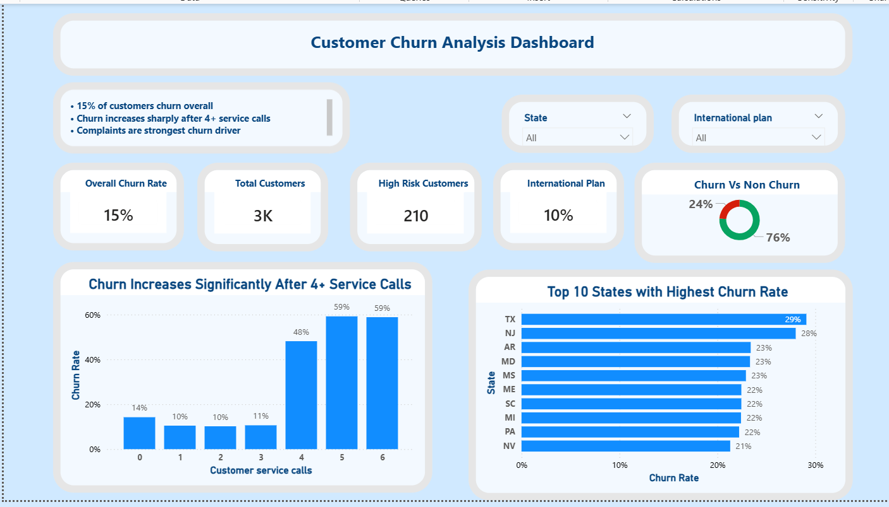
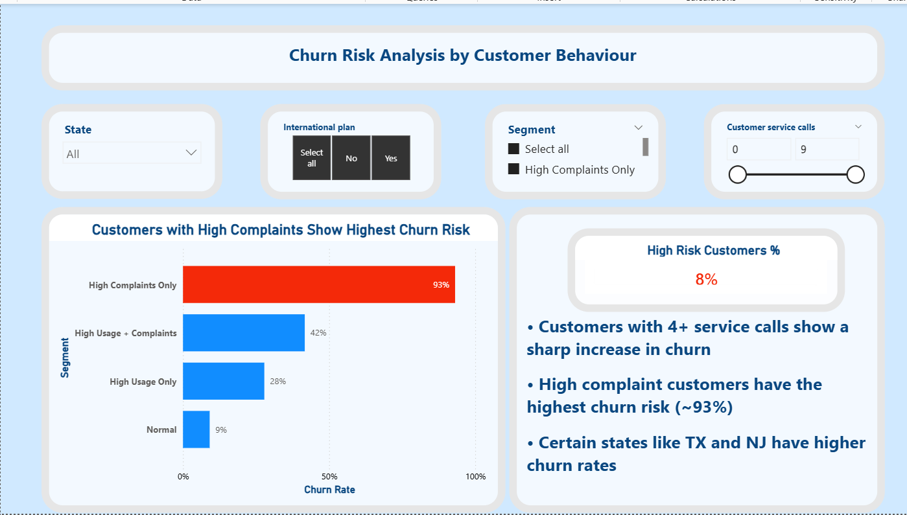

# Customer Churn Analysis Dashboard
# Workflow
**Python (EDA) → Power BI (Dashboard)**
This project follows a two-stage analytical workflow:
1. **Python (Pandas, NumPy)** — Initial exploratory data analysis (EDA): data cleaning, null handling, distribution checks, and correlation analysis on raw telecom data
2. **Power BI** — Interactive dashboard built on the cleaned dataset; DAX measures for churn rate, risk segmentation, and trend analysis

The Jupyter notebook (`Telecom_Analysis.ipynb`) contains the full Python EDA. The `.pbix` file contains the Power BI dashboard.

## Overview
This project analyzes telecom customer churn using Power BI. The dashboard identifies key churn drivers such as customer service calls, complaints, international plan usage, and state-level churn patterns.

## Dashboard Pages
1. **Overview**
   - Overall churn rate
   - Total customers
   - High-risk customers
   - International plan users
   - Churn vs non-churn distribution
   - Churn by customer service calls
   - Top churn states

2. **Customer Behavior Deep Dive**
   - Customer segment analysis
   - Service calls range filter
   - State and plan filters
   - Key churn insights

## Key Insights
- 15% of customers churn overall.
- Churn increases sharply after 4+ customer service calls.
- High complaint customers show the highest churn risk.
- States like TX and NJ show higher churn patterns.
- Customer service experience appears to be a major churn driver.

## Tools Used
- Power BI
- DAX
- Data Visualization
- Customer Segmentation

## Dataset
Telecom churn dataset from Kaggle.

## Screenshots

### Overview Page

### Deep Dive Page

## Business Recommendation
Focus retention efforts on customers with repeated service interactions and complaint-heavy behavior. Improving first-contact resolution and customer support quality may help reduce churn.
